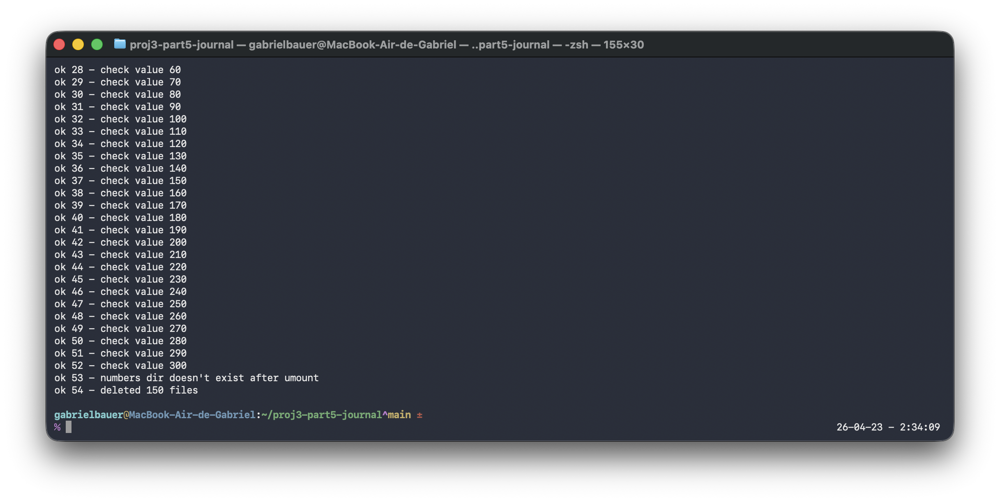
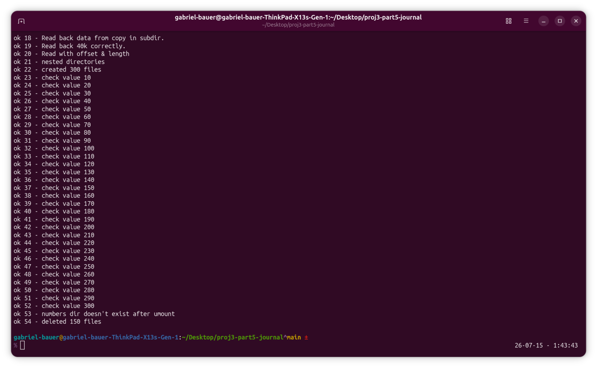
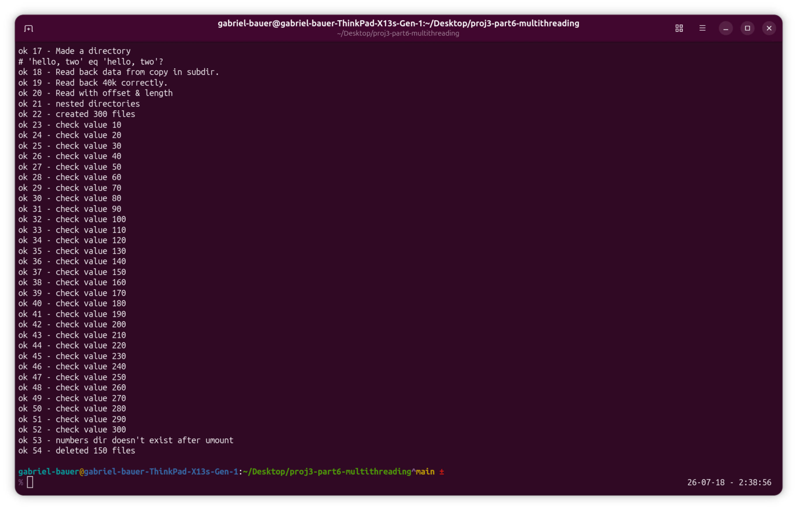
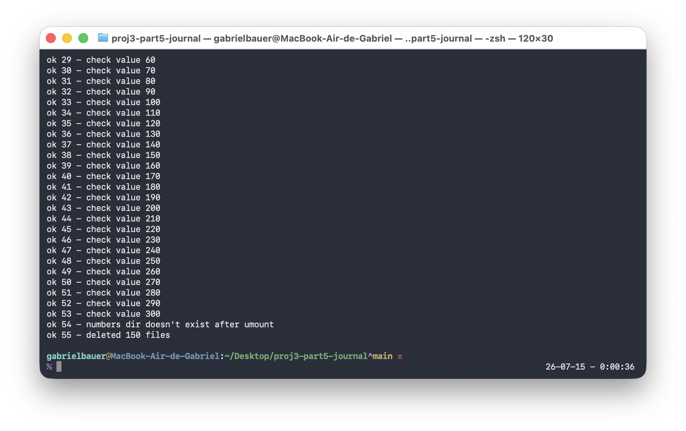
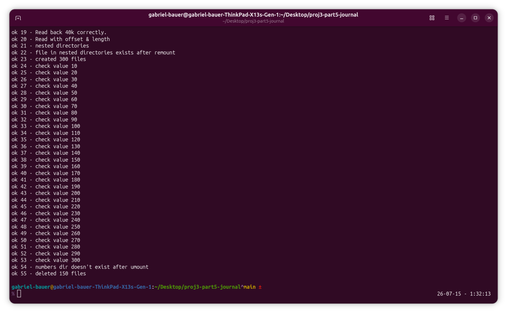
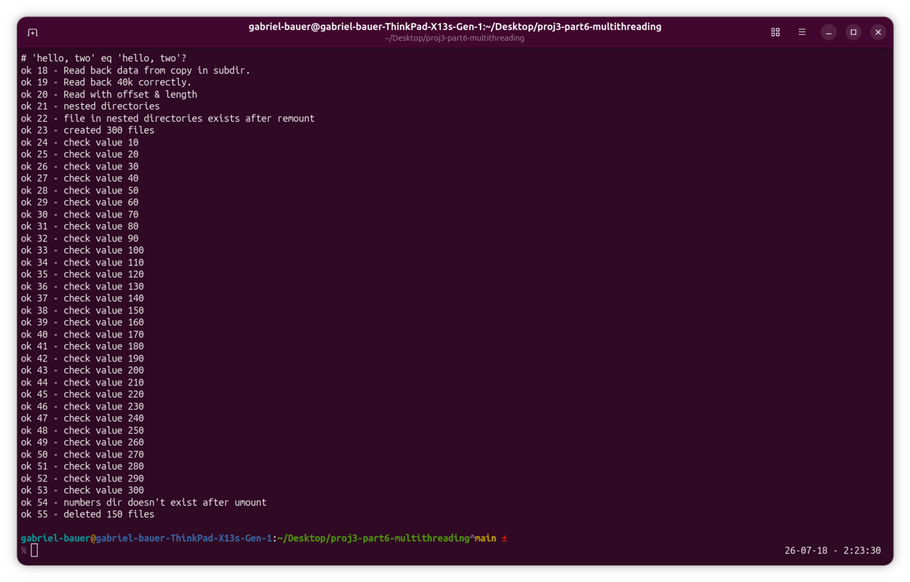

# B+Tree Filesystem Project

## Table of Contents
 - Architecture Documentation
    - [High Performance Block Cache](#High-Performance-Block-Cache)
    - [Security](#Security)
 - How To Use/Test
    - [Compilation](#Compilation)
    - [Testing](#Testing)
      - [Safe Condition](#Safe-Condition-Tests)
      - [Crash Recovery](#Journaling-Tests)
      	- [Multithreaded Journal Test](# Multithreaded-Journal-Test)
 - [Known Issues and Missing Features](#Known-Issues-and-Missing-Features)

## High-Performance Block Cache

This project implements a high-performance, fixed-size **Write-Back Block Cache** designed for a B-tree based filesystem. The core objective is to provide $\text{O}(1)$ performance for critical path operations such as block lookup, slot allocation, and eviction decisions by leveraging multiple, specialized data structures.

---

### 🏗️ Architecture and Data Structures

The cache operates as a **fixed-size memory pool** (an array of `cache_entry_t` structs) whose size is dynamically configured based on available system RAM during initialization.

The design is a classic example of balancing **Performance** (via hash maps and lists) and **Memory Boundary** (via the fixed array).

| Data Structure | Role | Optimization | Complexity |
| :--- | :--- | :--- | :--- |
| **Fixed-Size Array** (`cache->cache`) | **Physical Memory Pool** | The backing store for all block data and metadata. Enforces a strict memory limit. | $\text{O}(1)$ for direct index access |
| **Hash Map 1 (PCI)** (`PCI_HM`) | **Primary Cache Index** | Maps `block_number` to its array index/slot. Answers: "Is block X in the cache?" | $\text{O}(1)$ average for Lookup/Insert/Delete |
| **Doubly-Linked List** (`LRU_List`) | **Eviction Mechanism** | Tracks access recency. Head is MRU, Tail is LRU. Used for selecting a victim block on cache miss. | $\text{O}(1)$ for Eviction Decision (Tail) and Access Update (Move-to-Head) |
| **Singly-Linked List** (`FL_LL`) | **Free Slot Allocator** | Stores indices of currently unused slots in the Fixed Array. | $\text{O}(1)$ for Allocation and Deallocation (Push/Pop) |
| **Hash Map 2 (DL)** (`DL_HM`) | **`fsync` Optimizer** | Maps `inode_number` to a list of its associated dirty blocks. Essential for efficient, fine-grained durability. | $\text{O}(1)$ lookup for `fsync` |
| **Doubly-Linked List 2** (`GDL`) | **`sync` Optimizer** | Tracks all dirty pages in the block cache for efficient filesystem-wide `sync` operations. | $\text{O}(1)$ lookup for `sync` |

---

### 🛡️ Durability and Security Features

#### Write Policy (Durability)

The cache employs a **Write-Back** policy for high performance, where modifications are buffered in memory and marked with a `dirty_bit`. Durability is guaranteed through explicit synchronization calls:

* **`cache_fsync(inum)`:** Uses the **Per-Inode Dirty List (DL)** to quickly find and write back *only* the dirty blocks belonging to a specific inode, making it an $\text{O}(\text{Dirty Blocks for file})$ operation.
* **`cache_sync()`:** Uses the **Global Dirty List (GDL)** to write back *all* dirty blocks currently in the cache.

## Security

The implementation prioritizes data sanitization upon freeing memory to prevent information leakage:

* **Secure Wiping (`arc4random_buf`):** The BSD function `arc4random_buf` is used to overwrite the memory of all dynamically allocated structures (linked list nodes, hash map nodes, and the actual page data) with cryptographically secure random bytes immediately before calling `free()`. This is critical for cache entries that may contain sensitive data before being evicted.

---

## Compilation

The project uses a simple `GNUmakefile` to build on Linux and macOS, as well as a `BSDmakefile` for compilation on FreeBSD. The project requires the `bsd` library for `arc4random_buf` when compiling on Linux.

Currently, three Linux distributions are supported for the `install-deps.sh` script: Ubuntu, Linux Mint and Debian, although Arch Linux may be added in the future if I decide to create PKGBUILDs for the project. FreeBSD is supported. The macOS version requires [Homebrew](https://brew.sh) to be installed. It will also require the user to manually enable to macfuse kernel module. If planning to run the test suites, the user must also install Perl as well on their system of choice.

---

## Testing

This project contains two Perl tests suites. The first test suite under the name `test.pl` tests core of the filesystem under safe conditions with proper unmounting and remounting. It is an almost unmodified version of the test suite I got from [Nat Tuck](https://github.com/NatTuck) during my time in his course on Operating Systems at [Plymouth State University](https://www.plymouth.edu). The second test suite under `journaled-test.pl` is a slightly more modified version of the test suite which kills the FUSE driver at various points and tests the filesystem's ability to perform crash-recovery on metadata.

### Safe Condition Tests

The current version of the filesystem passes all of the tests on macOS, Arch Linux x86_64, and Ubuntu ARM64. Tests will also be performed on FreeBSD for consistency.

macOS:

Ubuntu ARM64:

#### Multithreaded Safe Condition Test

macOS:

Ubuntu ARM64:

### Journaling Tests
The current state of the journal is still not entirely stable, and it currently fails 5 out of 55 tests, though that is not a fair representation of the state of its stability, as the files it checks for values in tests 24-53 are not written within the filesystem itself, but the parent filesystem. That means it passes more like 20 out of 25.

macOS:

Ubuntu ARM64:

#### Multithreaded Journal Test

macOS:

Ubuntu ARM64:

## Known Issues and Missing Features

All known memory corruption and leaks have been snuffed out with the help of an Address Sanitizer.

There are three pressing missing features:

 - Double Indirect Blocks
 - Truncate Freeing Indirect and Double Indirect Parent Blocks
 - Multihtreading

